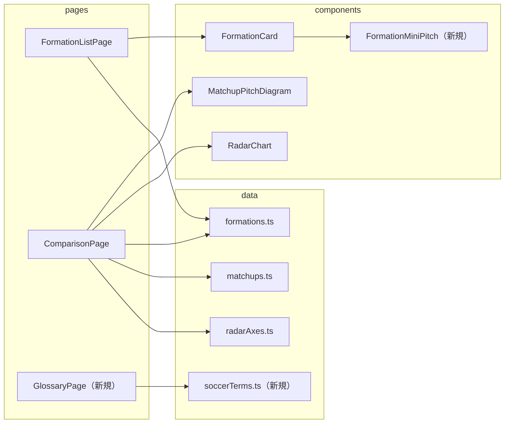

# 設計書

## アーキテクチャ概要

既存の 2 層構成（UI レイヤー `pages/` `components/` → データレイヤー `data/` `types/`）を
そのまま踏襲する。新しいレイヤー・ライブラリ・状態管理は導入しない。

`repository-structure.md`「ディレクトリ詳細」の依存制約を守る:

- `components/` は `data/` を **import しない**（props でデータを受け取る）
- `pages/` は `components/` `data/` `types/` に依存してよい
- `data/` は `types/` のみに依存する



## コンポーネント設計

### 1. FormationMiniPitch.vue（新規 / `src/components/`）

**責務**:

- フォーメーション 1 件の選手配置を、縦向きのミニピッチ図（SVG）として描画する
- 一覧カード内のプレビュー用途に限定した、装飾を抑えた表示を提供する

**実装の要点**:

- props は `formation: Formation` の 1 つのみ。データモジュールは import しない
- 座標変換: `formations.ts` の座標系は「左下原点・`y` が大きいほど攻撃方向」。
  SVG は左上原点・下方向が正のため、**`cy = 100 - y`** で上下を反転して攻撃方向を上にする。
  `cx = x` はそのまま使う（viewBox は `0 0 100 100`）
- `MatchupPitchDiagram.vue` は **再利用しない**。あちらは 2 チームを左右に向き合わせる
  専用の座標系（`colXByTeam` による横向き展開）を持ち、単独フォーメーションの
  「そのままの配置」を見せる本用途とは描画の意味が異なる。共通化するとどちらの
  座標ロジックも読みにくくなるため、小さな別コンポーネントとして分ける
- 装飾（芝ストライプ・センターサークル等）は最小限に留める。カード内で小さく表示するため、
  ポジションラベルは描画せず点のみとする（識別は説明文とフォーメーション名が担う）
- `role="img"` と `aria-label`（例: `4-3-3 の選手配置図`）を付ける。既存の
  `MatchupPitchDiagram.vue` と同じ a11y パターンに合わせる

### 2. FormationCard.vue（変更 / `src/components/`）

**責務**（既存に追加）:

- フォーメーション名に加えて、ミニピッチ図と説明文を表示する

**実装の要点**:

- 既存の選択トグル・キーボード操作（`role="button"` / `tabindex="0"` /
  `@keydown.enter` / `@keydown.space.prevent`）と `aria-pressed` は変更しない
- カードの高さが増えるため、一覧グリッドの `minmax(160px, 1fr)` はそのまま維持できるか
  実装時に確認する（列数の定義は `screen-design.md` の「最大3列の可変グリッド」を維持する）
- 説明文は長いため、カード内では 2〜3 行程度に収まる文字サイズ・行間で表示する

### 3. ComparisonPage.vue（変更 / `src/pages/`）

**責務**（既存に追加）:

- A/B の入れ替え、および A 側・B 側フォーメーションの切替による再遷移

**実装の要点**:

- 入れ替え: `router.replace('/compare/' + formationB.id + '/' + formationA.id)`
- 切替: セレクトの `change` で `router.replace('/compare/' + newA + '/' + b)`（B 側も同様）
- **`push` ではなく `replace` を使う**。比較画面から比較画面への移動は「同じ画面の表示内容を
  変える」操作であり、履歴に積むと「← 戻る」やブラウザバックで一覧へ戻るまでに
  比較画面を何度も経由することになる
- 既存の `formationA` / `formationB` / `matchup` は `route.params` 由来の `computed` のため、
  URL が変われば自動で再計算される。コンポーネント内に選択状態を別途持たない
  （状態の二重管理を避ける）
- 相手側で選択済みのフォーメーションは `<option :disabled>` にする。同一 ID の組み合わせは
  `getMatchup` が `undefined` を返し、画面全体がエラー表示に落ちるため UI 側で防ぐ
- セレクトには `<label>`（`aria-label` ではなく可視ラベル）を付け、何を選ぶ欄かを明示する
- 対戦演出アニメーション（FR-06）は URL 変更時に再生される。`ComparisonPage` は同一
  コンポーネントが再利用されるため、`MatchupPitchDiagram` に `:key` を与えて
  再マウントさせ、入れ替え後もスライドインが再生されるようにする

### 4. GlossaryPage.vue（新規 / `src/pages/`）

**責務**:

- サッカー用語の一覧を、用語・読み方・平易な説明の形式で表示する
- 一覧画面へ戻る導線を提供する

**実装の要点**:

- `data/soccerTerms.ts` を import して `v-for` で描画するだけの単純な画面
- 見出し（`<h1>`）＋定義リスト（`<dl>` / `<dt>` / `<dd>`）でマークアップする。
  用語と説明の対応が支援技術に伝わる構造を選ぶ
- カテゴリ（ポジション / 陣形・戦術 / 攻守の考え方）でグルーピングして表示する

### 5. soccerTerms.ts（新規 / `src/data/`）

**責務**:

- アプリが画面に表示する文章に登場するサッカー用語の定義を静的データとして保持する

**実装の要点**:

- 型 `SoccerTerm { id, term, reading, category, description }` を `types/formation.ts` に置く
  （既存の型定義の集約先に合わせる）
- 収録語は `matchups.ts` の優位ポイント文・`radarAxes.ts` の軸説明・`formations.ts` の
  説明文を走査して抽出する。推測で足さない
- 説明文は NFR-02 に従い、**別のサッカー用語を使わずに**説明する
  （用語の説明に用語が出てくると、初心者にとって解決にならない）
- `docs/specs/1_requirements/glossary.md` は開発者向けのユビキタス言語であり、
  本データはアプリ利用者向けの表示コンテンツである。**内容を二重に持たず**、
  `glossary.md` 側には「利用者向けサッカー用語の正本は `src/data/soccerTerms.ts`」という
  ポインタのみを置く（`matchups.ts` の解説文を docs に複製していないのと同じ扱い）

### 6. router/index.ts（変更）

- `/glossary`（`name: "glossary"`）を追加する

## データフロー

### UC: 比較画面から相手を変えて次の比較を見る

```
1. 利用者が比較画面の B 側セレクトで別のフォーメーションを選ぶ
2. ComparisonPage が router.replace('/compare/:A/:newB') を呼ぶ
3. route.params が変わり、formationA / formationB / matchup の computed が再評価される
4. MatchupPitchDiagram が :key の変化で再マウントされ、対戦演出が再生される
5. レーダーチャート・優位ポイント・総合判定が新しい組み合わせの内容に更新される
```

### UC: 一覧画面で配置を見比べてから選ぶ

```
1. FormationListPage が formations を FormationCard へ渡す
2. FormationCard が formation を FormationMiniPitch へ渡す
3. FormationMiniPitch が positions を cy = 100 - y で反転して SVG 上に描画する
4. 利用者が配置と説明文を見比べ、2 件を選択 → 既存の遷移処理へ
```

## エラーハンドリング戦略

新しいエラー種別は追加しない。既存の `functional-overview.md`「エラーハンドリング」の方針を
維持する。

- 同一フォーメーション同士の組み合わせは、セレクトの `disabled` により **UI 上発生させない**
  （URL 直打ち時の既存のエラー表示は従来どおり残す）
- 用語集画面はデータ取得を伴わないため、エラー状態を持たない
  （`soccerTerms` が空配列でも、見出しだけが表示されて落ちないこと）

## テスト戦略

### ユニットテスト（Vitest + @vue/test-utils）

既存のテストファイル配置（実装ファイルと同ディレクトリ・`*.test.ts`）に従う。

- `FormationMiniPitch.test.ts`
  - 全ポジション数（11 件）の円が描画される
  - `y` が大きいポジションほど `cy` が小さい（＝上に描画される）
  - `aria-label` にフォーメーション名が含まれる
- `FormationCard.test.ts`（既存に追加）
  - 説明文が表示される / `FormationMiniPitch` に `formation` が渡る
  - 既存の select emit・`aria-pressed` の検証が引き続き通る
- `ComparisonPage.test.ts`（既存に追加）
  - 入れ替えボタンで `router.replace` が A/B 逆順の URL で呼ばれる
  - セレクト変更で `router.replace` が正しい組み合わせで呼ばれる
  - 相手側で選択済みのフォーメーションの `option` が `disabled` である
  - `push` が呼ばれない（履歴を積まない）ことを確認する
- `GlossaryPage.test.ts`
  - `soccerTerms` の全件が描画される
  - データを空配列にモックしても描画が落ちない
- `soccerTerms.test.ts`
  - `id` が一意である
  - 全件が `term` / `description` を空でない文字列として持つ

### 統合テスト

**該当なし**: 本プロダクトは実 DB・バックエンドを持たず、`5_integration-test/` は対象外と
整理されている（`repository-structure.md`「docs/ 配下」）。

## 依存ライブラリ

新規追加なし。

## ディレクトリ構造

```
src/
├── components/
│   ├── FormationCard.vue          # 変更（ミニピッチ図・説明文の追加）
│   ├── FormationCard.test.ts      # 変更
│   ├── FormationMiniPitch.vue     # 新規
│   └── FormationMiniPitch.test.ts # 新規
├── data/
│   ├── soccerTerms.ts             # 新規
│   └── soccerTerms.test.ts        # 新規
├── pages/
│   ├── ComparisonPage.vue         # 変更（入れ替え・切替UI）
│   ├── ComparisonPage.test.ts     # 変更
│   ├── FormationListPage.vue      # 変更（用語集への導線）
│   ├── GlossaryPage.vue           # 新規
│   └── GlossaryPage.test.ts       # 新規
├── router/
│   └── index.ts                   # 変更（/glossary 追加）
└── types/
    └── formation.ts               # 変更（SoccerTerm 型の追加）
```

## 実装の順序

1. `types/formation.ts` に `SoccerTerm` を追加し、`data/soccerTerms.ts` を作成する
   （他への依存が無く、単独で完結するため最初に置く）
2. `FormationMiniPitch.vue` を作成し、`FormationCard.vue` へ組み込む（機能①）
3. `ComparisonPage.vue` に入れ替え・切替 UI を追加する（機能②）
4. `GlossaryPage.vue` とルート・導線を追加する（機能③）
5. テストを追加・更新し、品質チェック（test / lint / typecheck / build）を通す
6. ドキュメントを更新する

## セキュリティ考慮事項

- 表示するデータはすべてリポジトリ内の静的データであり、外部入力・認証情報を扱わない
- `v-html` は使わない（用語説明・優位ポイントとも Vue のテキスト補間で描画し、
  XSS の入口を作らない）
- URL パラメータ（`formationAId` / `formationBId`）は既存どおり `getFormationById` の
  照合に使うのみで、そのまま DOM へ流し込まない

## パフォーマンス考慮事項

- 一覧カードのミニピッチ図は 1 枚あたり SVG 要素 11 個程度、カード 4〜6 枚で計 70 要素弱。
  静的描画であり、実用上の負荷にならない
- 比較画面の切替は `computed` の再評価のみで、追加のデータ取得は発生しない

## 将来の拡張性

- `FormationMiniPitch.vue` は単独フォーメーションの描画という汎用的な単位のため、
  将来フォーメーション詳細画面を作る場合もそのまま流用できる
- `soccerTerms.ts` は配列へのデータ追加だけで用語を増やせる（NFR-03 と同じ思想）。
  将来インラインツールチップを実装する場合も、このデータを参照先にできる
