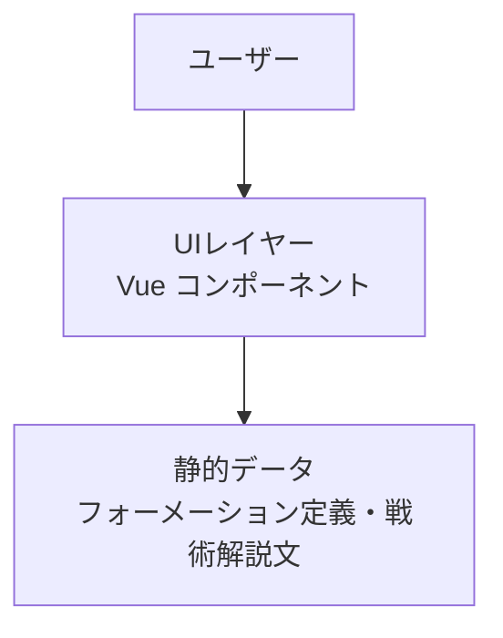
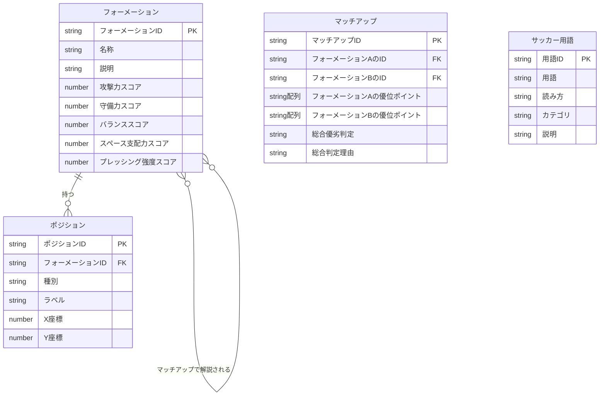
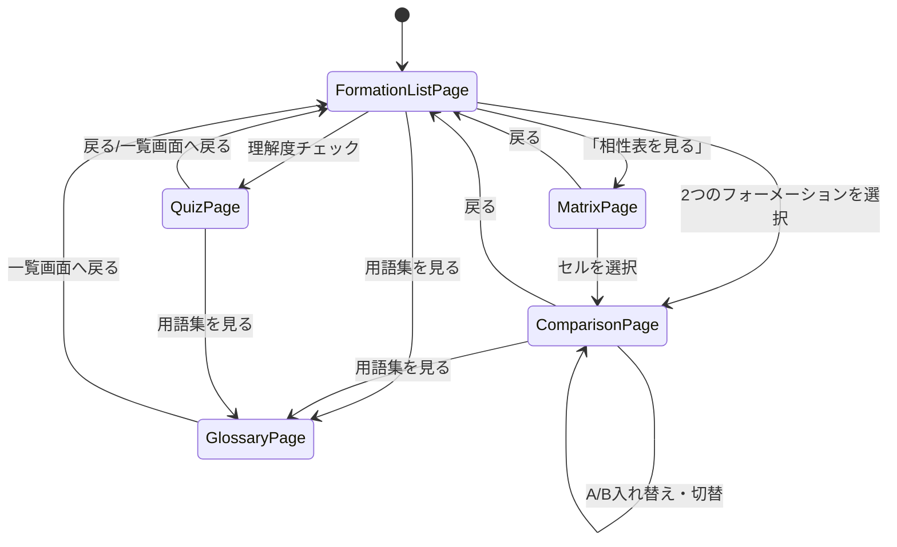
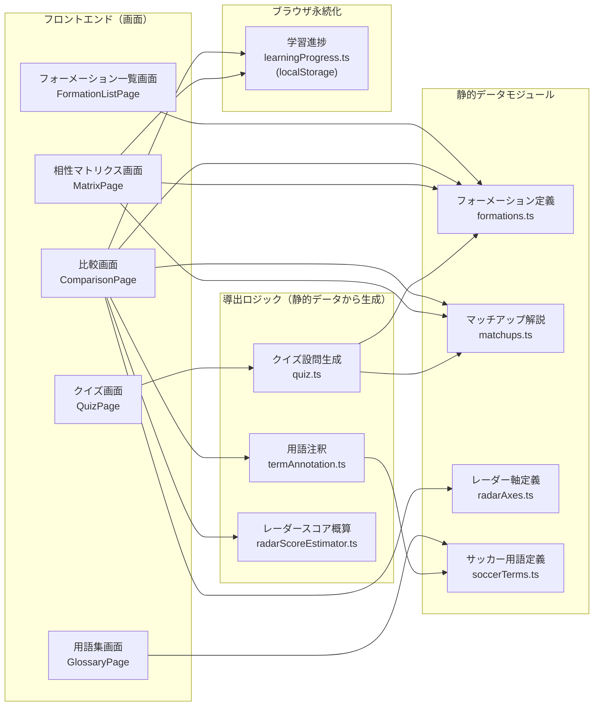

# 機能概要 — フォーメーションラボ

> 本ドキュメントは、プロジェクトの意思決定としてぶれてはいけない重要点（データモデル・
> 中核アルゴリズム・画面/ユースケースの一覧・画面設計・エラーハンドリング）を集約する。
> 技術スタック・アーキテクチャパターンは `architecture-overview.md` を正本とする。
>
> 本プロダクトはバックエンドを持たないため、「API一覧」「モジュール構成図」は
> 実態に合わせて簡略化している（該当なしの理由を明記）。

## システム構成図



本プロダクトはバックエンド・DBを持たない。UIレイヤーが静的データ（TS/JSONファイル）を
直接参照して画面を構築する2層構成。レイヤーの詳細な責務は `architecture-overview.md`
「アーキテクチャパターン」を正本とする。

## データモデル

> 本節は**概念モデル**（エンティティ・区分値・ドメイン上の制約）までを扱う。
> **本プロダクトはデータベースを持たないため、論理設計（`logical-data-model.md`）・
> 物理スキーマ（`table-definition.md`）の後続工程は不要。** データは以下の概念モデルに
> 沿った静的な TypeScript/JSON ファイルとして直接定義する。

### エンティティと区分値

- エンティティ: **フォーメーション** / **マッチアップ（フォーメーション組み合わせの解説）** /
  **サッカー用語**（アプリ内用語集の1エントリ。他エンティティとは独立し、関連を持たない）。
  関係: フォーメーション 1 ―― * ポジション（フォーメーションに含まれる配置）、
  フォーメーション * ―― * フォーメーション（マッチアップ経由で多対多）。
- コード・データで用いる区分値（型名と取りうる値）:
  - `PositionType` = `GK`（ゴールキーパー） | `DF`（ディフェンダー） | `MF`（ミッドフィルダー） | `FW`（フォワード）
  - `RadarAxisId` = `attack`（攻撃力） | `defense`（守備力） | `balance`（バランス） |
    `spaceControl`（スペース支配力） | `pressIntensity`（プレッシング強度）
  - `SoccerTermCategory` = `ポジション` | `陣形・戦術` | `攻守の考え方`

### ドメイン上の制約

- 1つのフォーメーションに含まれるポジション数の合計は、GKを含め11人でなければならない
  （GK 1人 + フィールドプレイヤー10人）。フォーメーション名（例: "4-2-3-1"）の数字の合計と、
  フィールドプレイヤーのポジション数は一致しなければならない。
- マッチアップ（フォーメーション組み合わせに対する戦術解説）は、2つのフォーメーションの
  **順序に依存しない**（フォーメーションAとBを選んでもBとAを選んでも同じ解説が表示される）。
  同一フォーメーション同士の組み合わせは存在しない（FR-02「比較対象の選択」で防止する）。

### ER図



> サッカー用語は他エンティティと関連を持たない独立したエンティティのため、上記ER図には
> 関連線を描かない。

### 確定事項（概念レベル）

- フォーメーションは開発時にあらかじめ用意する静的データであり、実行時にユーザーが作成・編集する
  ことはない（MVPの範囲では）。
- ピッチ上の座標系は、ピッチを縦長として左下を原点 (0, 0)、右上を (幅, 高さ) とする相対座標で
  表現する（具体的な数値・単位は基本設計工程で確定する）。
- マッチアップの優位ポイント（フォーメーションAの優位ポイント・フォーメーションBの優位ポイント
  の2つの配列）は、含まれる2つのフォーメーションIDの組み合わせごとに1件存在する
  （8種類全ての組み合わせ分、n(n-1)/2 = 28組）。「Aの弱点＝Bの優位点」という対称関係を
  前提とし、弱点は独立したフィールドとして持たない。
- **マッチアップは手書きの静的データではなく、フォーメーションの特徴タグから導出する**
  （後述「アルゴリズム設計」）。組み合わせ数はフォーメーション数nに対して n(n-1)/2 で増えるため、
  組み合わせごとに解説文を手書きするとコンテンツ拡張が破綻する（4種→8種で6組→28組）。
  執筆の単位を「組み合わせ」から「噛み合わせルール」へ移すことで、NFR-03（データ追加のみで
  拡張できる）を**表示だけでなく解説コンテンツについても**満たす。
  > **実地検証の結果（A-2）**: 「データ追加のみ」が成り立つのは、追加するフォーメーションが
  > **既存タグの組み合わせで表現できる場合**に限る（例: 4-1-4-1、3-4-3）。5バック・
  > 中盤ダイヤのように**構造的に新しい特徴**を持つ形を追加する場合は、タグ・噛み合わせルールの
  > 追加が必要になる（4種→8種の拡張で新規タグ3個・新規ルール9本を追加した）。
  > いずれの場合も**画面（`.vue`）の変更は不要**であり、NFR-03が保証するのは「画面が
  > フォーメーション数・組み合わせ数の変化に自動追随すること」であって「新しい戦術的特徴の
  > 解説が無条件でゼロコストになること」ではない（4種→8種の拡張作業、2026-09-13実施）。
- **フォーメーションは特徴タグを持つ。** 大半は選手配置から機械的に導出するが、配置座標に
  現れない特徴（例: 4-4-2 の「ライン間が空く」）は手動タグで補う。座標から導出しようとすると
  戦術的な意味と逆転する場合があるため（4-3-3 のほうがFWとMFのy差は大きいが、中盤が中央に
  密集するためライン間は空きにくい）、両者の併用が必要になる。
- マッチアップは、優位ポイントの箇条書きに加えて総合優劣判定（フォーメーションAが優位／
  フォーメーションBが優位／互角、のいずれか）と、その一言理由を持つ。優位ポイントの箇条書きの
  みでは総合的にどちらが有利かが読み取りにくいというフィードバックを受けて追加した。
- フォーメーションは、上記に加えて5軸（攻撃力・守備力・バランス・スペース支配力・
  プレッシング強度、いずれも0〜100）の特性スコアを持つ。この特性スコアは**フォーメーション
  単体に属する静的な値**であり、マッチアップのA/B入れ替えロジック（`getMatchup`が呼び出し
  順序に応じて`advantagesForA/B`・総合優劣判定を入れ替える処理）とは独立している
  （マッチアップ側にはA/Bそれぞれの特性スコアを持たせない）。
- サッカー用語は、アプリの解説文（優位ポイント・レーダー軸説明・フォーメーションの説明文）に
  実際に登場する用語のみを収録する（推測で追加しない）。用語の説明文は、他のサッカー用語を
  使わずに書く（`requirements-definition.md` NFR-02 準拠。説明に別の専門用語が出てくると、
  初心者にとって解決にならないため）。利用者向けのアプリ内表示コンテンツであり、開発者向けの
  ユビキタス言語である `glossary.md` とは役割が異なる（内容は重複させない。`glossary.md`
  側にはポインタのみを置く）。
- **学習進捗（FR-13）は、上記のエンティティとは独立してブラウザの`localStorage`に永続化する**
  概念モデル外の状態であり、ER図には含めない。保存する値は「確認済みの組み合わせ（フォーメーション
  2件の順序非依存キーの配列）」のみで、個人情報・秘匿値は含まない。データは静的ファイルではなく
  実行時に生成される点が、他のエンティティと性質が異なる。詳細は `component-design.md`
  「学習進捗トラッキング」を参照。
- **クイズの設問（FR-12）は永続化しない導出データ**であり、フォーメーション・マッチアップから
  画面表示のたびに生成する（`data/quiz.ts`）。したがって独立したエンティティとしては扱わない。

## アルゴリズム設計（ドメインロジック）

**マッチアップ解説の導出**が本プロダクト唯一の中核アルゴリズムである。
勝敗シミュレーション（スコア・支配率の疑似計算）はMVPのスコープ外
（`requirements-definition.md` §6.2 参照）。

### 処理の流れ

```
フォーメーション（選手配置 + 手動タグ）
    ↓ ① タグ導出
特徴タグ（3バック / 5バック / 2トップ / ウイング有 / 中盤ダイヤ / ライン間が空く など）
    ↓ ② ルール適用（自分のタグ × 相手のタグ）
適用ルール群（優位ポイントの文 + 根拠 + スコア）
    ↓ ③ テーマによる間引き
    ↓ ④ 優劣の算出
マッチアップ（優位ポイント・総合優劣判定・一言理由）
```

**① タグ導出**: 選手配置の種別ごとの人数と座標から機械的に判定する
（DF3人→`3バック`、外側かつ高い位置のFWが2人以上→`ウイング有` など）。
座標に現れない特徴は手動タグで補う。

**② ルール適用**: 「自分が満たすべきタグ × 相手が満たすべきタグ → 優位ポイント」の
ルール表を全件走査し、両条件を満たすものを集める。1つのルールは複数の言い回しを持ち、
組み合わせIDのハッシュで**決定的に**1つ選ぶ（実行のたびに文言が変わらないようにするため）。

**③ テーマによる間引き**: 各ルールは戦術テーマを持ち、**1つの噛み合わせで同一テーマから
採用するのは1件だけ**とする。これが無いと、同じ戦術を別の切り口で書いたルールが同時に当たり、
ほぼ同じ文が並んだうえ優劣スコアが二重計上される。文字列としては異なるため重複検知を
すり抜け、**テストが緑のまま総合判定だけが片側へ静かに歪む**。
重複発火は「条件の包含」と「タグの共起」の2経路で起き、後者はルール単体の定義を見ても
分からないため、テーマで括るのが確実な防ぎ方になる。

**④ 優劣の算出**: 両者の適用ルールのスコア合計の差で判定する（差が閾値以上で一方が優位、
それ未満は互角）。フォーメーション単体の特性スコア（レーダーチャートの5軸）は
**この判定に使わない**。使うと「噛み合わせ」ではなく単なる数値比較になるため、
ルールが1件も当たらない場合のフォールバック文の生成にのみ用いる。

### 設計上の制約

- 判定が意図と合わないとき、**閾値を動かして辻褄を合わせてはならない**。原因はルール表の
  左右非対称（片側のタグにだけルールが厚い）であり、閾値で合わせるとフォーメーションを
  追加した瞬間に全組の判定が崩れる。ルール表を補うこと
- ルールを追加・変更したら、**生成後の文言で用語集の収録語が維持されているか**を確認すること。
  テーマ間引きでルールが「静かに死ぬ」と、その語だけが解説から消える
- 総合判定の一言理由は、フォーメーション名を明示して組み立てる。A/B相対表現を使うと、
  `getMatchup` の入れ替え時に逆側を指す文言として表示される

> 実装の詳細（タグの導出条件・ルール表・テーマ一覧）は `src/data/formationTags.ts` /
> `matchupRules.ts` / `matchupGenerator.ts` を正本とする。

## API一覧

**該当なし**: 本プロダクトはフロントエンドのみで完結し、バックエンドAPIを持たない。
フォーメーションデータ・解説文は静的ファイルとしてビルド時にバンドルされる。

## 画面設計

### 画面一覧

| 画面名 | ルート(FE) | 対応コンポーネント | 目的 | 主な要素 | 主なデータ参照 |
|---|---|---|---|---|---|
| フォーメーション一覧画面 | `/` | `FormationListPage` | 比較したい2つのフォーメーションを選ぶ | フォーメーションカード一覧（ミニピッチ図・説明文含む）、選択状態の表示、相性マトリクス・用語集・クイズへの導線（ヘッダー内）、Jリーグ公式サイトへの外部リンク（ヘッダー内、新規タブ） | フォーメーション一覧（静的データ） |
| 比較画面 | `/compare/:formationAId/:formationBId` | `ComparisonPage` | ピッチ図と戦術解説をあわせて確認する | 重ね合わせピッチ図（対戦演出付き）、レーダーチャート、優位ポイントの箇条書き（用語インライン表示付き）、A/B入れ替え・切替、自由配置モード（Aチームのドラッグ操作・リセット）、試合シミュレーション・ハーフタイム采配モーダル（A/B両チームのドラッグ操作・リセット）、用語集への導線 | フォーメーション詳細（特性スコア含む）、マッチアップ解説（静的データ）、サッカー用語（静的データ）、学習進捗（`localStorage`） |
| 相性マトリクス画面 | `/matrix` | `MatrixPage` | 全フォーメーションの相性を一覧で俯瞰する | フォーメーション×フォーメーションのN×N表、行/列有利・互角・確認済みの色分け凡例、進捗表示、進捗消去 | フォーメーション一覧・マッチアップ解説（静的データ）、学習進捗（`localStorage`） |
| 用語集画面 | `/glossary` | `GlossaryPage` | 解説文に出てくるサッカー用語の意味を確認する | カテゴリ別の用語一覧、一覧画面への導線 | サッカー用語一覧（静的データ） |
| クイズ画面 | `/quiz` | `QuizPage` | フォーメーションの理解度を確認する | 設問カード（優劣判定・陣形識別・優位ポイント帰属）、回答後の正誤・解説表示、結果・再挑戦 | フォーメーション一覧・マッチアップ解説（静的データから動的に設問を生成） |

### 画面遷移図



### 表示仕様

**表示項目**

| 項目 | 説明 | フォーマット |
|------|------|-------------|
| フォーメーション名 | 一覧・比較画面で表示するフォーメーションの名称 | 例: "4-2-3-1" |
| ピッチ図 | 選手配置を示す図 | ピッチ形状の背景に、ポジションごとの点とラベルを配置。比較画面では2つのフォーメーションを同一エリアに重ねて表示する（1つのピッチ背景の上に、両フォーメーションの選手を色分けして配置） |
| 一覧カードのミニピッチ図 | 一覧カード内で、フォーメーション単体の選手配置を示す図 | 攻撃方向を上にした縦向きの簡易ピッチ図。ラベル無しの点のみで描画する |
| 優位ポイント | 選択した組み合わせにおける各フォーメーションの優位点を説明する文章 | フォーメーション名を見出しにした箇条書き。平易な日本語のテキスト（`requirements-definition.md` NFR-02 準拠） |
| レーダーチャート | 5軸（攻撃力・守備力・バランス・スペース支配力・プレッシング強度）でフォーメーション特性を可視化する図 | 選択した2つのフォーメーションのスコアを1つのチャート上に重ねて表示する。優位ポイントの箇条書きとは併存表示（置き換えではない） |
| サッカー用語一覧 | 用語集画面で表示するサッカー用語の一覧 | カテゴリ別にグルーピングした「用語・読み方・説明」の定義リスト |
| 用語インライン注釈 | 優位ポイント・総合判定理由の文中で、登録済みサッカー用語を強調表示する | 用語部分をボタンとして表示し、選択すると説明を吹き出しで表示する。用語が重なる場合は最長一致で切り出す |
| クイズの設問カード | クイズ画面で1問ずつ表示する設問 | 設問文・選択肢（優劣判定は3択、陣形識別・優位ポイント帰属は2〜4択）。陣形識別はミニピッチ図を伴う |
| 学習進捗の表示 | 相性マトリクス画面で表示する、確認済み組み合わせの状態 | セルへのチェック印（色以外の手段）、「確認済み N / 全 M 組み合わせ」の数値表示 |
| 自由配置モードのピッチ図 | 比較画面で自由配置モードON時に表示する、A・B両チームがドラッグ・キーボードで操作可能なピッチ図 | 実座標(0-100)を線形マッピングした描画（通常表示の非対称展開・衝突回避は行わない）。A・B両チームの選手がドラッグ操作、およびTab+矢印キーでのキーボード操作を受け付ける（WCAG 2.1.1対応）。変更した配置はフォーメーションID単位で永続化され、再度モードをONにすると復元される |
| 選手個体差（スカッドコンディション）の操作 | 比較画面で表示する、選手個体差の有効化・再生成トグル | ボタン2つ（有効化トグル・再生成）。有効時のみ試合シミュレーション結果に反映し、レーダーチャート・優位ポイントは変化しない |

**カラーコーディング**
- 比較画面で2つのフォーメーションを区別するため、フォーメーションAとBで異なる色（青 / 赤）を
  使う。ピッチ図の重ね合わせ表示・凡例・優位ポイントの見出し・レーダーチャートいずれも同じ
  色分けで統一する。

**アニメーション仕様（比較画面）**
- 比較画面を開くと、次の順序で演出が再生される: ①ピッチ図の両陣形が画面外からスライドイン
  して噛み合う → ②総合判定がポップインで表示される
- 利用者のOS/ブラウザで「視差やアニメーションを減らす」設定（`prefers-reduced-motion: reduce`）
  が有効な場合、上記アニメーションはすべて無効化し、最終状態を即座に表示する

## エラーハンドリング

| エラー種別 | 処理 | ユーザーへの表示 |
|-----------|------|-----------------|
| 存在しないフォーメーションIDへの直接アクセス（URL直打ち等） | 一覧画面へ誘導する | 「指定された組み合わせを表示できません」等のメッセージとともに一覧画面へのリンクを表示 |
| マッチアップ未検出（フォーメーションは2件とも存在するが組み合わせの解説文が無い。同一フォーメーション同士のURL直打ち等） | 一覧画面へ誘導する | 上記と同一のメッセージ・一覧画面へのリンクを表示 |

> **同一フォーメーションの重複選択（一覧画面での操作）はエラーとして扱わない。** 一覧画面の
> 選択操作はカードのトグル方式（`screen-design.md`「画面イベント」参照）であり、同じカードを
> 2回選ぶことは「選択→解除」を意味する。ある1つのフォーメーションを2つの比較枠に同時に
> 割り当てる操作自体がUI上存在しないため、この操作起因のエラーケースは発生しない。
>
> **ただし、比較画面へURLを直打ちした場合は話が別。** `/compare/4-4-2/4-4-2` のように同一の
> フォーメーションIDを2つ指定してアクセスすると、`getFormationById` は両方成功するが
> `getMatchup` が `undefined` を返す（マッチアップは異なる2件の組み合わせのみ用意している）。
> このケースは上表の「マッチアップ未検出」として一覧画面へ誘導する。
>
> **異なるフォーメーション同士でのマッチアップ未検出（データ追加漏れ）は、通常運用では
> 発生しない前提とする。** `requirements-definition.md` §7 の確定事項により、MVPで扱う
> フォーメーション全組み合わせ分の解説文をあらかじめ用意する運用のため。万一発生した場合も、
> 上表と同じエラー表示で扱われる（`matchups.test.ts`「全組み合わせのMatchup存在検証」で
> データ追加漏れそのものを検知する）。

## ユースケース一覧

| ID | ユースケース | アクター | 目的 | 関連画面 |
|---|---|---|---|---|
| UC-01 | フォーメーション同士を比較する | 利用者 | 2つのフォーメーションの噛み合わせ・有利不利を理解する | フォーメーション一覧画面、比較画面 |
| UC-02 | 全フォーメーションの相性を俯瞰する | 利用者 | どのフォーメーションが総合的に強い傾向にあるかを一覧で把握する | フォーメーション一覧画面、相性マトリクス画面、比較画面 |
| UC-03 | 用語の意味を確認する | 利用者 | 解説文に出てくるサッカー用語の意味を確認する | フォーメーション一覧画面、比較画面、用語集画面 |
| UC-04 | 理解度を確認する | 利用者 | フォーメーションの特徴を自分が説明できるか、クイズで確認する | フォーメーション一覧画面、クイズ画面 |
| UC-05 | 学習の進み具合を把握する | 利用者 | どの組み合わせを確認済みか把握し、1周したかを判断する | 比較画面、相性マトリクス画面 |
| UC-06 | 配置を変えて有利不利の変化を確かめる | 利用者 | 自分で選手を動かし、噛み合わせがどう変わるかを能動的に発見する | 比較画面 |

## モジュール構成図

**簡略化**: バックエンドAPIを持たないため、「画面 × API × バックエンド」の対応図の代わりに、
「画面 × 参照する静的データモジュール」の対応図とする。



> **自由配置モード（FR-15）の補足**: 比較画面(`ComparisonPage`)は、自由配置モード中のみ
> `formationTags.ts`の`getTags`・`matchupGenerator.ts`の`generateMatchup`を直接呼び出し、
> ドラッグ後の配置から都度タグ・マッチアップを再計算する（通常時は`matchups.ts`が
> ビルド時に事前計算した結果をIDルックアップするのみで、これらを直接呼ばない）。
> 図の簡略化方針上、既存の`matchups.ts`に内包されるこれらのモジュールは個別のノードとして
> 描いていないが、依存関係の詳細は `src/pages/ComparisonPage.vue` を参照。

> **ハーフタイム采配（FR-19）の補足**: `composables/matchSimulation.ts`（FR-14の試合
> シミュレーション本体）も図の簡略化方針上ノード化していない。FR-19は同モジュールの
> `startMatch`/`resumeMatch`（前半・後半に分けて実行できるよう内部リファクタしたもの）を
> `ComparisonPage.vue`から呼び出す。後半に配置変更を反映する際は、FR-15と同じパターン
> （`formationTags.ts`の`getTags`・`matchupGenerator.ts`の`generateMatchup`をUIレイヤーが
> 直接呼び出す）でA/B両チームの配置変更に対応する。詳細は
> `src/components/HalftimeTacticsModal.vue` / `src/pages/ComparisonPage.vue` を参照。

**読み方**:
- 画面 → 静的データ: 各画面が参照するデータモジュール。
- データモジュールの物理配置は [リポジトリ構造定義書](repository-structure.md) を参照。
